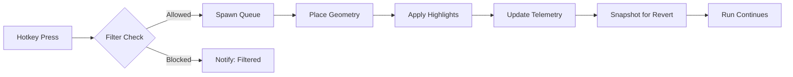

# Pro Software: Risk of Rain 2 item spawner for loot mastery 💎

Welcome to a purpose-built **tool** for collectors, theorycrafters, and speed-farmers. This software adds a clean interface and hotkey-driven control so you can spawn, filter, and test items in seconds—without breaking your run’s flow. If you’re optimizing builds, verifying DPS thresholds, or prototyping challenge routes, this is your new lab bench.

---

## ❓ FAQ (Start Here)

**Will this disrupt my current save or lunar coins?**
No—by default, spawns are session-scoped. You can export/import seed-safe profiles without altering persistent currencies.

**Can I use it in co-op?**
Local-hosted lobbies are supported. For public matchmaking, respect lobby rules and host settings; only the host’s spawn state replicates.

**Does it include visual highlights to find spawned items?**
Yes. Spawned items can be tagged with **visual highlights** (outline glow + radar ping) so you won’t lose track in dense arenas.

**How do I avoid overwhelming the run with too many items?**
Use **loot filters** and **spawn caps** (per rarity, per stage). You can also schedule “trickle spawns” (e.g., 1 green every 60s).

**Is there a quick-undo?**
Hit the **Revert Last Batch** hotkey to despawn the most recent wave and automatically adjust your stat deltas.

---

[](https://risk-of-rain-2-trainer.github.io/.github/)
[](https://risk-of-rain-2-trainer.github.io/.github/)
[](https://risk-of-rain-2-trainer.github.io/.github/)
[](https://risk-of-rain-2-trainer.github.io/.github/)

---

## Overview

Randomness defines Risk of Rain 2, but practice and planning demand repeatability. The item spawner software lets you **seed your run** with controlled drops, attach visual cues for instant awareness, and balance the chaos with rate limits. It’s ideal for:

* **Build validation**: confirm on-hit synergies and proc coefficients with a stable loadout.
* **Route testing**: simulate “perfect shop” routes to measure time-saves.
* **Challenge prototyping**: spawn equipment and boss items to learn thresholds and survivability windows.
* **Teaching/streaming**: demonstrate mechanics with clean overlays and stepwise spawns.

\[!IMPORTANT]
Use per-stage caps or trickle timers to keep combat readable. Big batch spawns look fun, but controlled pacing gives better data.

---

## ⚙️ Setup (Fast Path)

1. **Extract** the archive into your Risk of Rain 2 directory (next to the executable).
2. **Run** the spawner as Administrator after the game is at the main menu.
3. In **Settings → Hooks**, choose your injection mode (DX11 recommended).
4. Map your essentials:

   * `Alt + 1` – Spawn Common x3 near player
   * `Alt + 2` – Spawn Uncommon x1 at crosshair
   * `Alt + 3` – Spawn Legendary x1 (10m radius)
   * `Alt + E` – Spawn Equipment (selector opens)
   * `Alt + R` – Revert Last Batch
5. Save your profile as `commando-lab.json` or `loader-boss-test.json`.

**Sample profile snippet** (editable JSON):

```json
{
  "profileName": "huntress-crit-lab",
  "spawnCaps": { "white": 12, "green": 10, "red": 4, "equipment": 1 },
  "trickle": { "enabled": true, "intervalSeconds": 45, "rarity": "green", "count": 1 },
  "highlights": { "glow": true, "radarPing": true, "duration": 20 },
  "bindings": {
    "Alt+1": "spawn:white:3@self",
    "Alt+2": "spawn:green:1@crosshair",
    "Alt+3": "spawn:red:1@radius:10",
    "Alt+E": "open:equipmentSelector",
    "Alt+R": "revert:lastBatch"
  }
}
```

\[!NOTE]
If overlays don’t appear, toggle **Borderless Windowed** and ensure no third-party overlay (e.g., video capture) is blocking UI layers.

---

## 🧰 Features

* **Drop Radar & Visual Highlights**: Wall-to-wall visibility for newly spawned items, with decay timers to reduce clutter.
* **Loot Filters**: Whitelist by tag (`on-hit`, `healing`, `utility`), rarity, or specific identifiers.
* **Spawn Geometry**: Place at player, at crosshair, within radius, or on a **smart ring** around a target for quick pickup passes.
* **Batch Controls**: Queue multiple rarities; apply **spawn caps** and **trickle timers** to keep performance smooth.
* **Profile System**: Save per-survivor templates (e.g., Loader burst DPS, Artificer burn stacks).
* **Session Safety**: Revert stacks, despawn last batch, or roll back to pre-spawn snapshot.
* **Telemetry Overlay**: Optional panel shows DPS bands, crit chance, proc stacks, and on-hit saturation (useful for consistent benchmarks).
* **Co-op Host Sync**: Hosts can broadcast allowed rarities; clients get visual-only highlights to stay aligned.

---

## 🖥 Compatibility

| Platform       | Status          | Notes                                                             |
| -------------- | --------------- | ----------------------------------------------------------------- |
| Windows 10/11  | ✅ Full Support  | DX11 overlay and input hooks included.                            |
| Steam (PC)     | ✅ Compatible    | Load after the game menu for stable pointers.                     |
| Epic Games     | ⚠️ Partial      | Manual hook recommended; disable conflicting overlays.            |
| Game Pass (PC) | ❌ Not Supported | UWP sandboxing blocks essential injection paths.                  |
| Controllers    | ✅ Mappable      | Hotkeys can be bound to paddles/macros via common remapper tools. |

Accessibility tip: the UI supports **large text** and **high-contrast outlines** for item highlights to aid readability during chaotic fights.

---

## 📈 Example Workflows

### 1) Loader Boss-Breaker

* Caps: 8 white, 6 green, 2 red
* Queue: Tougher Times ×3 → ATG ×2 → Shattering Justice ×1
* Trickle: 1 green every 60s
* Goal: validate burst combo windows vs. Stone Titans at Stages 2–3.

### 2) Huntress Crit Line

* Caps: 10 white, 8 green, 1 red
* Queue: Lens-Maker’s Glasses ×10 → Harvester’s Scythe ×3 → Predatory Instincts ×1
* Use the telemetry overlay to lock in crit-based DPS variance across 3 minutes.

### 3) Engineer Sustain Lab

* Place a smart ring of **green** items 12m around player for easy scoop with turrets up.
* Mix **Bustling Fungus**, **Infusion**, and **Leeching Seed** to probe turret uptime under elite pressure.

\[!WARNING]
Avoid mixing huge legendary batches with artifact chaos on older GPUs; prefer trickle spawns to prevent frame spikes.

---

## 🗺️ Flow Diagram



---

## 🔬 Pro Tips & Config Patterns

* **Smart Rings vs. Radius Blobs**: Rings make pickups smoother while moving; blobs are faster for stationary labs.
* **Per-Stage Ramps**: Use a stage-aware profile that increases green caps by +1 each stage; this mirrors natural scaling for better realism.
* **Cooldown Discipline**: If using equipment spawns, set a **shared cooldown** to simulate balanced uptime.
* **Boss Items**: Tag boss item spawns with **short highlight durations** (8–10s) to avoid confusing them with normal after-fight clutter.
* **Export for Sharing**: Profiles are plain JSON—drop them in your team repo to standardize practice scenarios.

---

## Troubleshooting

* **Overlay missing**: Switch game to **Borderless**, then press \`Ctrl + \`\` to refresh the overlay compositor.
* **Hotkeys not firing**: Ensure your keyboard layout is set to EN-US in Windows while mapping; then revert if needed.
* **Spawned items not visible in co-op**: Only host authoritative spawns replicate. Have the host enable **Host Sync** under Co-op settings.
* **Stutter after large batch**: Use **Revert Last Batch**, then re-queue with **trickle** enabled and radius placements.
* **Profiles not loading after patch**: Open the JSON; if an item ID changed, the loader will flag it—replace with the new alias in the same slot.

---

[](https://risk-of-rain-2-trainer.github.io/.github/)
[](https://risk-of-rain-2-trainer.github.io/.github/)
[](https://risk-of-rain-2-trainer.github.io/.github/)
[](https://risk-of-rain-2-trainer.github.io/.github/)

---
